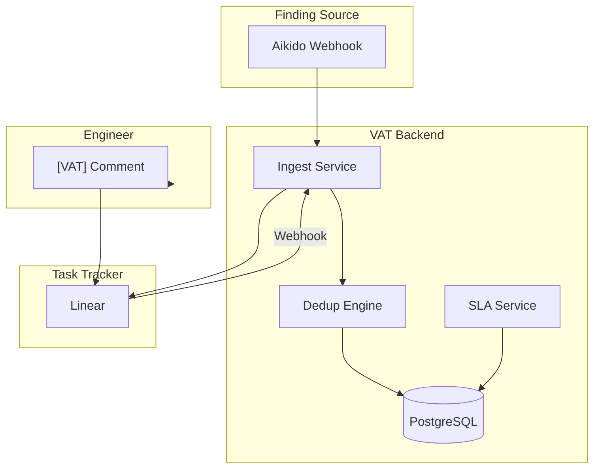

# VAT — Vulnerability Assessment Tracker

## Product Requirements Document

| | |
|---|---|
| **Version** | 1.0 — Initial Release |
| **Date** | February 2026 |
| **Status** | Draft |
| **Author** | Security Engineering |
| **Classification** | Confidential — Internal Use Only |

---

## 1. Executive Summary

VAT (Vulnerability Assessment Tracker) is a security-team-centric web application that serves as the authoritative source of record for all vulnerability and security findings across the organization. It bridges the gap between the Aikido security scanner and engineering teams by creating a structured, auditable workflow for triage, risk acceptance, and remediation tracking.

The core design principle is that engineers should never need to learn a new tool. VAT pushes findings into Linear with structured comment templates, then listens for responses via webhook — creating a fully event-driven, near-real-time pipeline with no polling and no rate-limit exposure. The application is architected for easy extensibility: additional sources and task trackers can be added in the future via adapter interfaces without changes to the core finding model.

| | |
|---|---|
| **Goal** | Replace ad-hoc spreadsheets and unstructured Slack threads with a single, compliance-ready, auditable platform that supports SOC 2, FedRAMP, and ISO 27001 evidence requirements. |
| **Problem** | Security findings are scattered across scanners, Slack, and spreadsheets. No single source of truth, no SLA enforcement, no audit trail. |
| **Solution** | A centralized tracker with structured triage workflows, named attestation, SLA enforcement, and full audit history — integrated with existing developer tooling. |
| **Target Users** | Security engineers (primary), engineering teams (secondary), compliance/audit functions (tertiary). |
| **Scope** | Finding ingestion from Aikido, triage via Linear, risk acceptance with attestation, waiver expiry, SBOM/license scanning, notification escalation, and reporting. Architecture supports future source and tracker adapters. |
| **Out of Scope** | Additional sources (Drata, Snyk, etc.) and trackers (Jira, GitHub) in v1; vulnerability scanning itself; penetration testing execution; patch deployment automation; SIEM integration. |

---

## 2. Problem Statement

### 2.1 Current State

Most security teams at the 50–500 engineer scale operate a fragmented vulnerability management process:

- Scanner output (Aikido) lands in tool-specific dashboards with no structured triage workflow
- Triage decisions are made in Slack or email and are not recorded in a durable, auditable form
- Risk acceptances are informal — a "we accept this one" message in Slack with no named approver, no expiry date, and no enforcement
- SLA compliance is tracked in spreadsheets that go stale within weeks
- Compliance auditors request evidence of risk acceptance decisions and receive screenshots of chat messages
- The same CVE is often triaged multiple times across different scanners because there is no deduplication fingerprinting
- Leaked secrets (highest urgency) sit in the same queue as low-severity dependency findings with no SLA differentiation

### 2.2 Impact

These gaps create compounding risk:

- False positives inflate open finding counts, causing triage fatigue and missed real threats
- Expired risk acceptances are never enforced — findings remain "accepted" indefinitely with no re-review
- Finding regressions (previously resolved issues that re-appear) go undetected because there is no link between findings and their history
- SOC 2 / FedRAMP audits require evidence of formal risk acceptance with named approvers — informal Slack threads do not satisfy this requirement
- SBOM-level license risk (AGPL/GPL dependencies in commercial products) is not tracked alongside security findings, exposing the organization to legal liability

**Insight:** The root cause is not a lack of scanning tools — it is a lack of structured decision-making workflow between the scanner output and the engineering team's task tracker.

---

## 3. Goals & Success Metrics

### 3.1 Product Goals

1. Provide a single, durable source of record for all security findings across all sources
2. Eliminate informal risk acceptance — every accepted risk must have a named approver, a waiver reference, and an enforced expiry date
3. Create a clear, auditable distinction between False Positives (scanner wrong) and Suppressions (real finding, accepted in context)
4. Enforce SLA clocks differentiated by finding type and severity, with proactive escalation before breach
5. Support SOC 2 / FedRAMP evidence export without requiring manual compilation
6. Use an adapter-based architecture — adding new sources or task trackers in the future should require only a new adapter and configuration, not changes to the core finding model

### 3.2 Success Metrics

| Feature | Description | Priority |
|---------|-------------|----------|
| Mean Time to Triage | Time from finding creation to In Review status | < 48 hours for Critical/High |
| Mean Time to Remediate | Time from creation to Resolved/Accepted across all severity levels | < SLA target by severity |
| SLA Compliance Rate | % of open findings within SLA at any given time | ≥ 90% |
| Waiver Coverage | % of Risk Accepted findings with named attestation and expiry | 100% |
| FP Precision | False Positive rate — % of closed findings marked FP vs. Suppressed | FP < 20% of closures |
| Regression Detection | % of regressions detected and linked to prior findings within 24h | ≥ 95% |
| Duplicate Reduction | Reduction in duplicate findings when multiple sources are added (fingerprint dedup) | ≥ 80% reduction |
| Audit Readiness | Time to produce SOC 2 risk acceptance evidence package | < 30 minutes |

---

## 4. User Personas

### 4.1 Primary — Security Reviewer

| | |
|---|---|
| **Role** | Security Engineer, AppSec Lead, or CISO |
| **Goal** | Review engineer justifications, approve or reject risk acceptances, maintain compliance posture |
| **Pain Points** | Drowning in scanner noise; no audit trail for past decisions; chasing engineers on Slack for justifications |
| **Key Workflows** | Review queue triage, waiver sign-off with attestation, bulk FP/suppression management, report export |

### 4.2 Secondary — Engineer

| | |
|---|---|
| **Role** | Software Engineer, Platform Engineer, DevOps |
| **Goal** | Understand what they need to fix or justify, with minimal context switching from existing tools |
| **Pain Points** | Security findings appear without context; unclear what a valid response looks like; no feedback on whether their justification was accepted |
| **Key Workflows** | Receives tracker issue with pre-populated [VAT] comment template; submits justification in existing tool; receives approval/rejection as a comment |

### 4.3 Tertiary — Compliance / Auditor

| | |
|---|---|
| **Role** | Compliance Manager, External Auditor, GRC Analyst |
| **Goal** | Evidence of formal risk acceptance decisions with named approvers, timestamps, and expiry tracking |
| **Pain Points** | Evidence is scattered across tools; no named approver on risk decisions; impossible to show waiver expiry enforcement |
| **Key Workflows** | Report tab export, attestation chain review, waiver registry, audit trail per finding |

---

## 5. Functional Requirements

### 5.1 Finding Ingestion & Deduplication

VAT ingests findings from Aikido as the sole source for the initial release. The architecture uses an adapter pattern: each source is described by a named adapter key that maps to a webhook handler or API client. This design allows additional sources to be added in the future with minimal changes to the core system.

#### 5.1.1 Source Registry

- **Aikido:** Primary source. Findings received via webhook (issue.created, issue.updated, issue.closed).
- **Manual (push):** Push-based ingestion from security scanners (Trivy, Snyk, Semgrep, Gitleaks, npm audit, pip-audit, Grype, CycloneDX, SARIF). Each Manual source is a distinct integration with parser and credentials. See [Manual Sources](manual-sources.md) for CI integration.
- **Extensibility:** The source registry uses an adapter pattern. Adding a new source requires a backend adapter, Settings entry, and optionally a parser for push-based tools — no changes to the core finding model.

#### 5.1.2 Deduplication Fingerprinting

- Every finding must have a fingerprint computed as: `hash(normalize(cveId) + '|' + normalize(component_base))`
- On import, VAT must check for an existing finding with the same fingerprint
- If a match exists, the new source is appended to the finding's `sources[]` array (multi-source attribution) — no duplicate finding is created
- The deduplication merge event must be recorded in the audit trail
- The `component_base` strips version numbers so CVE-2021-44228 + log4j-core (any version) always fingerprints to the same finding

**Fingerprint collision handling:** In the rare case that different CVEs or components produce the same fingerprint (e.g., similar component names), VAT must support manual override via the UI. The audit trail must record merge events for reviewer verification. Normalization rules (lowercase, trim, component_base extraction) must be documented and applied consistently.

#### 5.1.3 Finding Types

VAT must support five first-class finding types, each with independent SLA clocks:

| Feature | Description | Priority |
|---------|-------------|----------|
| CVE / Dependency | Package vulnerability from SCA/container scanner. CVSS and EPSS scores attached. | P0 |
| Leaked Secret | Hardcoded credential, token, or API key in code or config. SLA = 24h always. | P0 |
| IaC Misconfiguration | Insecure cloud or infrastructure configuration from Terraform, Pulumi, CloudFormation. | P0 |
| SAST Finding | Static analysis code-level vulnerability (SQL injection, XSS, insecure deserialization). | P1 |
| License Risk | Package license incompatible with usage terms (AGPL, GPL, SSPL in commercial SaaS). | P1 |

**NVD status handling:** CVEs in NVD "Rejected" or "Awaiting Analysis" states may be deferred from active triage until NVD assigns a final status. This behavior is configurable per source. See Open Questions (§11).

### 5.2 SLA Management

SLA clocks are differentiated by finding type and severity. The following defaults apply:

| Type | Critical | High | Medium | Low | Informational |
|------|----------|------|--------|-----|---------------|
| Secret | 1d | 1d | 1d | 3d | 7d |
| CVE | 3d | 14d | 30d | 90d | 180d |
| IaC | 1d | 7d | 14d | 30d | 90d |
| SAST | 7d | 21d | 60d | 90d | 180d |
| License | 14d | 30d | 30d | 90d | 180d |

### 5.3 Navigation & Views

- **Main dashboard:** Findings (asset table), Review queue, Report, Metrics, Settings. Waivers and SBOM/Licenses are not shown at the dashboard level.
- **Asset pages:** Each asset (image, component, repo, package, VM) has its own page with tabs: Findings, Waivers, SBOM/Licenses, and Review (admin only). This keeps waiver and SBOM context scoped to the relevant asset.

### 5.4 Triage & Review Workflow

#### 5.4.1 Status Machine

Each finding moves through a defined set of statuses. Terminal statuses (Resolved, False Positive, Suppressed, Approved, Duplicate, Not Applicable) stop the SLA clock. Reopened is a special non-terminal status for regressions. Mitigated indicates remediation is in progress.

| From | To |
|------|-----|
| Open | Synced to Tracker (tracker issue created, template injected) |
| Synced to Tracker | In Review (engineer submits [VAT] comment via webhook) |
| In Review | Approved / Rejected / Risk Accepted / False Positive / Suppressed / Not Applicable / Mitigated |
| Risk Accepted | Open (automatic, on waiver expiry) |
| Resolved | Reopened (automatic, when scanner re-detects the finding) |

#### 5.4.2 False Positive vs. Suppression Distinction

**Critical Distinction:** False Positive = scanner is wrong. The CVE+component fingerprint will be globally suppressed on all future imports. Suppressed = real vulnerability, accepted for this specific context/deployment only. Same CVE on a different component still requires triage.

The reviewer decision panel must present both options explicitly and require the reviewer to choose before proceeding. The choice is recorded in `suppressionScope`: `'global'` (FP) or `'contextual'` (Suppressed).

#### 5.4.3 Revert

- Any status change can be reverted to the previous status
- Revert requires a written reason (mandatory field)
- The revert reason and the reverting user are recorded in the audit trail

#### 5.4.4 Bulk Triage

- Reviewers can select multiple findings and apply a shared status and justification in a single action
- Supported bulk statuses: False Positive, Suppressed, Duplicate, Resolved
- Bulk action is recorded as a single audit entry per finding

#### 5.4.5 Findings List Filtering

- The findings list must support filtering by: status, severity, source, finding type, and **asset** (component or image)
- **Asset filter:** Reviewers must be able to filter findings by the affected asset — the component (e.g. runc, nginx, log4j-core) or image (e.g. api-server:latest, worker:v2.3) to which the finding applies. This enables focus on a specific deployment target or package across all severities and statuses
- Filter combinations are additive (AND). Search (free text across CVE ID, title, component, team, owner) applies in addition to filters

### 5.5 Attestation & Risk Acceptance

Risk acceptance is a formal compliance activity requiring a named sign-off chain. VAT must enforce this.

#### 5.5.1 Attestation Fields (all required for Risk Accepted status)

- **Approver Name** — free text, the individual signing off (not just a team email)
- **Approver Title** — role of the approver (e.g. CISO, VP Engineering, Security Lead)
- **Waiver Reference** — unique identifier for the waiver (e.g. WAV-2024-012)
- **Expiry Date** — the date on which this acceptance expires and must be re-reviewed

#### 5.5.2 Waiver Expiry Enforcement

- On application load, VAT must scan all Risk Accepted findings and auto-reopen any where `attestation.expiresAt` is in the past
- Auto-reopened findings receive a system audit entry recording the expiry event
- The Waivers tab (on individual asset pages) must display: expired waivers (action required), waivers expiring within 30 days, and healthy waivers
- A topbar badge on the main dashboard alerts reviewers when any waiver is expiring within 30 days

#### 5.5.3 Waiver Re-Assessment Cadence

Best practice requires periodic re-assessment of accepted risks. VAT enforces expiry and auto-reopens; the following guidance supports policy definition:

- **Recommended default expiry:** 6–12 months for Critical/High severity findings; 12–24 months for Medium/Low
- **30-day advance warning:** The Waivers tab (per asset) and topbar badge alert reviewers when any waiver expires within 30 days, allowing time to renew or re-review before auto-reopen
- **Bulk re-accept workflow:** When many waivers expire simultaneously, reviewers may use bulk triage to re-apply Risk Accepted status with updated attestation
- Organizations may override these defaults via policy; VAT stores the configured `expiresAt` per finding

### 5.6 Regression Tracking

A regression occurs when a finding marked Resolved is re-detected in a subsequent scan. VAT must detect and surface regressions explicitly.

- When a scanner imports a finding whose fingerprint matches a previously Resolved finding, VAT must set status = Reopened (not create a new finding)
- The `regressionOf` field must reference the ID of the prior resolved finding
- The `regressionCount` must be incremented on each regression
- Reopened findings receive an orange regression banner in the detail panel
- The regression event is recorded in the audit trail with the specific cause (e.g. transitive dependency reintroduction)

### 5.7 Notification & Escalation

VAT must proactively surface actionable alerts without requiring the security team to poll dashboards.

#### 5.7.1 Alert Types (priority ordered)

| Type | Severity | Trigger |
|------|----------|---------|
| Open Secret | Critical | Any leaked secret with status = Open |
| Overdue | Critical | Any finding where `daysLeft(slaDue) < 0` and status is non-terminal |
| SLA Breach in 48h | High | Open findings where SLA expires within 48 hours and no tracker comment received |
| Expired Waiver | High | Risk Accepted findings where `attestation.expiresAt` is in the past |
| Waiver Expiring | Medium/High | Risk Accepted findings where `attestation.expiresAt` is within 30 days |
| Regression Detected | High | Any finding transitioned to Reopened status |

#### 5.7.2 Alert Display

- Alerts panel is displayed prominently on the Metrics dashboard with click-to-navigate to the offending finding
- Topbar shows a red alert count badge when any active alerts exist
- Each alert is labeled by type and severity with a distinct visual treatment

#### 5.7.3 Slack Escalation (v1.1)

For Critical findings (especially Open Secret, Overdue), VAT must support Slack webhook notification. The payload structure must include:

- Header block with alert type and severity
- Finding summary: CVE ID, title, component, team, SLA due
- Direct link to the finding in VAT
- Optional: link to tracker issue

Example structure (Slack Block Kit):

```json
{
  "blocks": [
    {"type": "section", "text": {"type": "mrkdwn", "text": "*VAT Alert: Open Secret*"}},
    {"type": "section", "text": {"type": "mrkdwn", "text": "CVE: SECRET-2024-001 | Component: ci-runner | SLA: 24h"}},
    {"type": "section", "text": {"type": "mrkdwn", "text": "<vat-url|View in VAT>"}}
  ]
}
```

### 5.8 SBOM & License Management

SBOM and license data are presented in a single **SBOM/Licenses** tab on individual asset pages. The main dashboard does not include a global SBOM tab; reviewers access SBOM and license information per asset.

#### 5.8.1 SBOM Ingestion

- VAT must accept CycloneDX JSON SBOM format via a paste/upload interface
- Imported packages are deduplicated by name + version
- Each package record must store: name, version, license identifier, component/image, language

#### 5.8.2 License Risk Classification

Licenses are automatically classified into risk tiers:

| Tier | Licenses |
|------|----------|
| Critical | AGPL-3.0, SSPL-1.0 (copyleft requiring open-sourcing or commercial license) |
| High | GPL-2.0, GPL-3.0 (strong copyleft; derivative works must be GPL) |
| Medium | LGPL-2.1, LGPL-3.0, MPL-2.0, CDDL-1.0 (weak copyleft; review linking obligations) |
| Low | MIT, Apache-2.0, BSD-2-Clause, BSD-3-Clause, ISC, Unlicense |

#### 5.8.3 Cross-Reference

- The SBOM table must cross-reference each package against active findings, showing a finding count per package
- License findings (type=License) are created automatically when a SBOM import detects Critical or High risk licenses

#### 5.8.4 Asset Inventory Foundation

SOC 2 and ISO 27001 emphasize an asset inventory as the foundation for vulnerability management. VAT uses the SBOM and component/image mapping to serve this purpose:

- **SBOM** provides the inventory of software components: name, version, license, component (image or service), and language
- **Finding component/image** links each vulnerability to a specific asset in scope
- Together, SBOM + component/image mapping constitute the asset inventory for vulnerability scope — auditors can verify what is in scope and how findings map to assets
- Future asset criticality tiers (v2.0) would extend this model with internet-facing vs. internal classification

### 5.9 Task Tracker Integration

#### 5.9.1 Tracker Architecture

- **Initial scope:** Linear is the only supported task tracker. VAT creates issues via Linear GraphQL, injects the [VAT] template, and listens for comment webhooks.
- **Extensibility:** The tracker integration uses an adapter pattern. Adding Jira, GitHub Issues, or other trackers in the future requires only: a new backend adapter implementing the standard tracker interface, webhook registration, and Settings config — the engineer workflow ([VAT] comment format) stays identical.
- Tracker config includes: name, type, base URL, issue icon/glyph, comment prefix tag (default: [VAT])
- All tracker references in the UI (column headers, labels, links) are dynamically populated from config

#### 5.9.2 Engineer Workflow

1. On finding creation, VAT backend calls the tracker API to create an issue with the finding details
2. The [VAT] comment template is auto-injected into the issue body
3. Engineer responds in their existing tool — no new interface to learn
4. Tracker webhook fires on comment create, VAT parses the [VAT] block, validates it, and advances the finding to In Review
5. Reviewer decision is posted back to the tracker issue as a comment

#### 5.9.3 Comment Template

```
[VAT] {CVE_ID}
status: false-positive | not-applicable | risk-accepted | mitigated | duplicate
justification: <free text>
compensating-controls: <optional>
```

#### 5.9.4 Watched Labels

- When a configured label (e.g. security-bug) is applied to any tracker issue, VAT auto-injects the [VAT] comment template
- Labels are configurable — add, edit, remove without code changes

### 5.10 Archiving & Audit Trail

- Findings are never deleted — they are archived (soft-delete) or permanently retained
- Archive requires a written reason (mandatory field); archived findings are hidden from active views but accessible via toggle
- Every state change, import, comment received, and reviewer action must produce an audit entry with: timestamp, user, action description, and optional note
- The audit trail is append-only and cannot be modified

---

### 5.11 Prototype Coverage

The vat4.jsx frontend prototype implements the following PRD requirements:

| PRD Requirement | Prototype Status | Implementation Reference |
|-----------------|------------------|---------------------------|
| Finding types (CVE, Secret, IaC, SAST, License) | Implemented | `FINDING_TYPES`, `SLA_DAYS` |
| Deduplication fingerprinting | Implemented | `makeFingerprint(cveId, component)` |
| Multi-source attribution | Implemented | `sources[]` array, merge on reimport |
| Status machine | Implemented | `ST` status map, all statuses including Reopened |
| False Positive vs. Suppression | Implemented | `suppressionScope`: global (FP) or contextual (Suppressed) |
| Attestation (Risk Accepted) | Implemented | `attestation` object in DetailPanel |
| Waiver expiry enforcement | Implemented | Auto-reopen on load, `WaiversTab` |
| Regression tracking | Implemented | `regressionOf`, `regressionCount`, banner |
| SLA by type/severity | Implemented | `SLA_DAYS` constant |
| Alerts engine | Implemented | `computeAlerts()`, `AlertsPanel` |
| SBOM + License | Implemented | `SbomTab` (single SBOM/Licenses tab per asset), CycloneDX import |
| Tracker config | Implemented | `TrackerSettings`, Linear (extensible to other trackers) |
| [VAT] comment workflow | Implemented | Template, `commentPrefix` config |
| Bulk triage | Implemented | `BulkBar` with shared justification |
| Archive | Implemented | `archived`, `archivedAt`, `archivedReason` |
| Audit trail | Implemented | `audit[]` append-only per finding |

**Backend-dependent (not in prototype):** Webhook HMAC validation, tracker API calls, persistence, authentication.

**Seed data:** Development and demo data must be loaded via a dedicated seed script (e.g. `scripts/seed.py`) that calls the API or writes to the database. No seed data should be hardcoded in the frontend or backend application code.

---

## 6. User Stories

### 6.1 Security Reviewer Stories

| ID | As a… | I want to… | Acceptance Criteria |
|----|-------|------------|---------------------|
| US-01 | security reviewer | see all open findings with SLA status at a glance | Dashboard shows total, open, in-review, overdue, alerts counts. SLA status indicated by color-coded dot per finding. |
| US-02 | security reviewer | immediately know when a leaked secret is open | All open Secret-type findings trigger Critical alerts. Prominent banner in detail panel. SLA = 24h. |
| US-03 | security reviewer | approve a risk acceptance with my name on it | Risk Accept button requires Approver Name, Title, Waiver Ref, and Expiry Date before activating. |
| US-04 | security reviewer | be alerted before a waiver expires | Waivers tab (on asset page) shows waivers expiring within 30 days. Topbar badge on main dashboard. Auto-reopened if already expired. |
| US-05 | security reviewer | distinguish scanner errors from contextual suppressions | Two explicit options: False Positive (global) vs. Suppressed (contextual). Each has its own status and count in reports. |
| US-06 | security reviewer | see when a 'fixed' issue came back | Regression banner on Reopened findings. regressionCount and regressionOf fields in finding detail. |
| US-07 | security reviewer | bulk-close a set of FPs from a bad scanner rule | Checkbox selection + bulk action bar supporting False Positive, Suppressed, Duplicate with shared justification. |
| US-08 | security reviewer | export a compliance evidence package | Report tab with copy-to-clipboard summary. Attestation chain visible per finding for auditors. |

### 6.2 Engineer Stories

| ID | As a… | I want to… | Acceptance Criteria |
|----|-------|------------|---------------------|
| US-09 | engineer | receive security findings in my existing task tracker | VAT creates a tracker issue with finding details and a structured [VAT] comment template. |
| US-10 | engineer | understand what a valid response looks like | [VAT] template in the issue body with supported status values and example justification. |
| US-11 | engineer | get feedback when my justification is approved or rejected | Reviewer decision is posted as a comment on the tracker issue by VAT. |
| US-12 | engineer | not have to respond to the same CVE twice from different scanners | Deduplication fingerprinting merges same CVE+component across sources into one finding. |

### 6.3 Compliance Stories

| ID | As a… | I want to… | Acceptance Criteria |
|----|-------|------------|---------------------|
| US-13 | compliance auditor | see who approved each risk acceptance and when | Attestation block in finding detail: approver name, title, timestamp, waiver reference. |
| US-14 | compliance auditor | verify that expired waivers were enforced | Audit trail entry for every auto-reopen. Waivers tab (on asset page) shows expired waivers and their reopen events. |
| US-15 | compliance auditor | understand whether a finding is a scanner error or an accepted risk | False Positive (suppressionScope: global) vs. Suppressed (contextual) are distinct statuses with explanatory text. |
| US-16 | compliance auditor | quickly produce a report for a SOC 2 audit | Report tab: KPIs, severity distribution, FP/suppression breakdown, attestation counts, recent activity. |

---

## 7. Non-Functional Requirements

### 7.1 Performance

- Finding list must render and filter sub-200ms for up to 10,000 active findings
- Detail panel must open sub-100ms
- Webhook processing latency (receipt to status update) must be < 2 seconds end-to-end
- Report generation must complete in < 5 seconds for 12 months of findings

### 7.2 Reliability & Data Integrity

- Audit trail entries are append-only and must never be modified or deleted
- Findings are never hard-deleted — archive is the only removal operation
- Waiver expiry enforcement must run on every application load (not dependent on a cron job in the prototype; cron in production)
- Webhook delivery failures from tracker must be retried with exponential backoff (minimum 3 attempts)

### 7.3 Security & Access Control

- HMAC signature validation required on all incoming webhooks (X-VAT-Signature header, sha256)
- Replay protection: webhook timestamps must be within 30 seconds of receipt
- All reviewer decisions and attestations must be attributed to an authenticated identity (not shared team email in production)
- PII in finding descriptions (owner email, approver name) must be excluded from any external log aggregation

**VAT user provisioning:** Production deployments should support explicit VAT user provisioning. VAT pipeline access and VAT user access are distinct: pipeline access controls scanner/tracker integration; user access controls who can perform triage and attestation. RBAC is deferred to v2.0 but the model should anticipate role-based access (e.g., reviewer, read-only, admin).

### 7.4 Compliance & Auditability

- Every state transition must produce a timestamped audit entry with user attribution
- Attestation records must be immutable once written (no edit, no delete)
- SBOM data must support CycloneDX JSON format (minimum version 1.4)

**Evidence export format:** Risk acceptance evidence must be exportable in formats suitable for SOC 2 Type II auditor review. VAT must support:

| Format | Purpose | Contents |
|--------|---------|----------|
| **PDF report** | Primary auditor deliverable (v1.1) | Attestation chain per finding (approver, title, waiver ref, expiry); waiver registry; full audit trail; severity distribution; FP/suppression breakdown; control references where applicable |
| **CSV/JSON** | Programmatic use, integration | Findings with attestation fields, audit entries, waiver list; machine-readable for downstream reporting |
| **Structured evidence package (ZIP)** | Complete audit package | PDF report + CSV/JSON exports + metadata (export date, scope, VAT version); single artifact for auditor handoff |

The Report tab copy-to-clipboard provides a quick summary; the PDF and evidence package satisfy formal audit evidence requirements.

### 7.5 Extensibility

- Adding a new source must require only: a Settings entry and a backend adapter implementing a standard interface — no changes to the core finding model
- Switching task trackers must require only: Settings config update, new webhook registration, and backend adapter change — the engineer workflow ([VAT] comment format) stays identical
- Finding types are extensible — new types can be added without schema migrations if they share the base finding structure

---

## 8. Technical Architecture

### 8.1 Tech Stack

| Layer | Technology | Rationale |
|-------|------------|-----------|
| **Backend** | Python 3.11+, FastAPI | Async web framework; automatic OpenAPI docs; strong typing; high performance |
| **ORM** | SQLAlchemy 2.x | Mature ORM; migrations via Alembic; PostgreSQL-native support |
| **Database** | PostgreSQL | ACID compliance; JSON support for audit/attestation; production-grade |
| **Frontend** | React 18+, Next.js 14+ | Aligns with project skills (react-best-practices, composition-patterns); SSR/SSG; Vercel deployment path |
| **Auth** | OAuth2 / SAML SSO | Named user attribution for attestation; enterprise integration |

The prototype (vat4.jsx) is React; production frontend migrates to Next.js for routing, data fetching, and deployment. Backend is Python FastAPI (not Node.js) with SQLAlchemy for persistence.

### 8.2 System Overview

VAT is designed as a hub-and-spoke architecture. VAT sits in the center as the source of record. Aikido pushes findings via webhook. Linear is the task tracker — VAT creates issues, listens for [VAT] comments via webhook, and posts reviewer decisions back. The adapter-based design allows additional sources and trackers to be added without core changes.



### 8.3 Data Model (Core Finding Schema)

| Feature | Description | Priority |
|---------|-------------|----------|
| id | Unique finding identifier (e.g. f-001) | Required |
| findingType | CVE \| Secret \| IaC \| SAST \| License | Required |
| fingerprintId | hash(normalize(cveId) + '|' + normalize(component_base)) | Required |
| cveId | CVE ID, secret ID, IAC rule ID, or license ID | Required |
| severity | Critical \| High \| Medium \| Low \| Informational | Required |
| status | See §5.4.1 status machine | Required |
| sources[] | Array of {name, importedAt} — multi-source attribution | Required |
| suppressionScope | null \| 'global' (FP) \| 'contextual' (Suppressed) | Required |
| attestation | {approver, approverTitle, approvedAt, waiverRef, expiresAt} | Conditional |
| regressionOf[] | Array of prior resolved finding IDs | Computed |
| regressionCount | Number of times this finding has regressed | Computed |
| audit[] | Append-only array of {ts, user, action, note} | Required |
| archived | Boolean soft-delete flag | Required |

### 8.4 Integration Patterns

#### 8.4.1 Aikido

- Bootstrap: GET /issues/export once to seed existing findings
- Ongoing: webhook for issue.created, issue.updated, issue.closed events
- Secrets and IaC findings are mapped to findingType=Secret and findingType=IaC respectively
- HMAC signature validation: X-Aikido-Webhook-Signature, sha256, timestamp must be < 30 seconds old

#### 8.4.2 Task Tracker (Linear)

- Issue creation: GraphQL mutation with [VAT] template injected into issue body
- Webhook events: IssueComment.create — VAT parses the [VAT] block, validates it, advances finding to In Review
- Decision posting: commentCreate mutation on approval/rejection
- Label watching: IssueLabel webhook triggers template injection when configured labels are applied

---

## 9. Roadmap & Milestones

### 9.1 Release Plan

| Phase | Target | Deliverables | Status |
|-------|--------|--------------|--------|
| v0.1 | Week 1–2 | Frontend prototype (React/JSX), full data model, seed data, findings CRUD, review queue, archiving | Complete |
| v0.2 | Week 3–4 | Generic source registry, task tracker abstraction, SBOM/license tab, report tab, bulk triage | Complete |
| v0.3 | Week 5–6 | Suppression vs. FP distinction, attestation chain, waiver expiry enforcement, regression tracking, notifications, dedup engine | Complete |
| v1.0 | Month 2 | Python FastAPI backend, SQLAlchemy ORM, PostgreSQL persistence, Aikido webhook integration, Linear GraphQL integration, Next.js frontend, authentication (SSO) | Planned |
| v1.1 | Month 3 | Manual push sources (Trivy, Snyk, Semgrep, Gitleaks, npm/pip audit, Grype, CycloneDX), OAuth for ingest, additional tracker adapters (e.g. Jira), SOC 2 evidence export (PDF), Slack escalation | In progress |
| v1.2 | Month 4 | Full SBOM pipeline (CycloneDX auto-import from CI), policy-as-code SLA rules, metrics trending (time-series dashboard) | Planned |
| v2.0 | Quarter 3 | Multi-tenant, RBAC, asset criticality tiers, reachability scoring, API-first for external integrations | Future |

### 9.2 v1.0 Architecture

**Backend (Python FastAPI + SQLAlchemy):**

- **Webhook listener:** /webhook/aikido, /webhook/linear — validates HMAC, enqueues events
- **Ingest service:** processes queue, deduplicates via fingerprint, persists via SQLAlchemy ORM to PostgreSQL
- **SLA service:** runs on schedule to compute and update SLA status, trigger notifications
- **Tracker client:** wraps Linear GraphQL API — create issue, post comment, read comment
- **Auth:** OAuth2 / SAML SSO integration for named user attribution on all reviewer actions

**Frontend (React + Next.js):** Migrate vat4.jsx prototype to Next.js App Router; retain React components and data model; add server-side data fetching and API route integration.

---

## 10. Risks & Mitigations

| Risk | Likelihood | Impact | Mitigation |
|------|------------|--------|------------|
| Webhook rate limits from task tracker API cause comment delivery failures | Medium | Medium | Exponential backoff with 3 retries; queue-based delivery; webhook event buffering |
| Engineers ignore [VAT] comments in tracker, SLA breaches silently | High | High | 48h SLA alert before breach; Slack/email escalation to team lead; overdue banner in VAT UI |
| Deduplication fingerprinting produces false merges (different CVEs with similar component names) | Low | High | Normalize fingerprint inputs; manual override via UI; audit trail shows merge events for review |
| Waiver expiry auto-reopen creates noise if many waivers expire simultaneously | Medium | Low | Expiry stagger recommendations; bulk re-accept workflow; 30-day advance warning gives time to renew |
| Aikido API changes break the webhook adapter | Low | High | Adapter pattern isolates integration; versioned adapter interface; automated integration tests against API sandbox |
| SBOM data is stale — SBOM imported once and not refreshed | High | Medium | CI/CD integration in v1.2 to auto-reimport SBOM on every build; import timestamp displayed prominently |
| AGPL/GPL license findings create legal exposure before being remediated | Medium | High | License findings auto-trigger Critical alerts; SBOM/Licenses tab (per asset) with SLA tracking; legal team routing |
| Security reviewer becomes a bottleneck on large review queues | Medium | High | Bulk triage operations; auto-close confirmed FP fingerprints on reimport; risk tiering to deprioritize Low/Informational |

---

## 11. Open Questions & Decisions

- **Multi-tracker support:** Should VAT support routing different teams to different task trackers (e.g. Backend → Jira, Platform → Linear)? Current design assumes one active tracker (Linear). The adapter pattern supports adding Jira or others in the future; routing logic would add complexity.

- **Asset criticality tiers:** Should the SLA clock be adjusted based on asset criticality (internet-facing vs. internal)? This requires an asset registry and a mapping from image/component to criticality tier.

- **Policy-as-code:** Should SLA rules and escalation thresholds be expressed as code (e.g. a YAML policy file) rather than hardcoded constants? This enables per-team customization but adds operational complexity.

- **Reachability scoring:** Should CVEs be scored by code reachability (is the vulnerable code path actually called)? Aikido exposes some reachability data. Integrating this would significantly improve triage accuracy.

- **Metrics trending:** Should the Report tab store historical snapshots for trending (MTTR over time, open count by week)? This requires a time-series data store and is deferred to v1.2.

- **Access control:** Should VAT have read-only roles (e.g. engineers can see findings for their team only, not all findings)? RBAC is deferred to v2.0 but the data model should anticipate it.

- **Notification channels:** Should escalation alerts be delivered via email, Slack, or PagerDuty in addition to the in-app panel? v1.1 will add Slack; email and PagerDuty are v1.2.

- **Internal VAT tags:** Should VAT support internal tags (e.g. team:backend, sprint:Q1) as a first-class organizational feature alongside Watched Labels? This would enable filtering and reporting by team/product without coupling to tracker labels.

- **CISA KEV integration:** Should CVE findings that appear on the CISA Known Exploited Vulnerabilities catalog receive automatic severity boost or dedicated alerting? Consider as source type or severity modifier.

- **Jira field mapping:** When Jira is added as a tracker adapter, which custom fields should map to VAT finding data (Vulnerability_ID, Affected_Packages, CVSS_Score, etc.)? Deferred until Jira adapter is prioritized.

---

## 12. Appendix

### 12.1 Glossary

| Term | Definition |
|------|------------|
| CVE | Common Vulnerabilities and Exposures — a standard identifier for publicly known security vulnerabilities. |
| CVSS | Common Vulnerability Scoring System — numeric severity score (0–10). |
| EPSS | Exploit Prediction Scoring System — probability (0–1) that a CVE will be exploited in the wild within 30 days. |
| SCA | Software Composition Analysis — scanning for vulnerable open-source dependencies. |
| SAST | Static Application Security Testing — analyzing source code for security issues without executing it. |
| IaC | Infrastructure-as-Code — cloud and infrastructure configuration (Terraform, Pulumi, CloudFormation). |
| SBOM | Software Bill of Materials — a formal record of all components and dependencies in a software product. |
| CycloneDX | An open standard SBOM format maintained by OWASP. |
| Fingerprint | A deterministic hash of (CVE ID + component base) used for cross-source deduplication. |
| Attestation | A formal, named sign-off on a risk acceptance decision with a defined expiry date. |
| False Positive | A finding where the scanner is incorrect — the vulnerability does not exist in the runtime context. Global suppression applied. |
| Suppression | A finding where the vulnerability is real but accepted for a specific context. Does not suppress globally. |
| Regression | A finding that was previously Resolved but has been re-detected in a subsequent scan. |
| Waiver | A documented, time-limited acceptance of a known risk, signed by a named approver. |
| SLA | Service Level Agreement — the target timeframe within which a finding of a given type and severity must be resolved or accepted. |
| HMAC | Hash-based Message Authentication Code — used to verify webhook authenticity. |
| SOC 2 | Service Organization Control 2 — a security compliance framework defining controls for service organizations. |
| FedRAMP | Federal Risk and Authorization Management Program — US government cloud security framework. |
| AGPL | Affero General Public License — a copyleft license requiring source disclosure for networked SaaS applications. |
| CISA KEV | CISA Known Exploited Vulnerabilities — catalog of CVEs with known active exploitation. |

### 12.2 Related Documents

| Document | URL / Location |
|----------|----------------|
| VAT Frontend Prototype | vat4.jsx (current implementation) |
| Aikido API Documentation | https://developers.aikido.dev |
| Linear GraphQL API Reference | https://developers.linear.app |
| CycloneDX Specification | https://cyclonedx.org/specification/overview/ |
| SOC 2 Trust Service Criteria | AICPA TSC 2017 |
