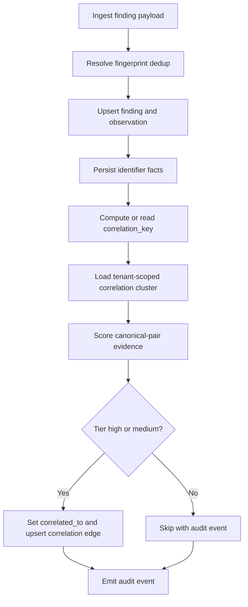

# Correlation And Linking Architecture

This document explains how VAT correlates findings across sources while remaining non-destructive, auditable, reversible, and aligned to the current backend-owned ingest/enrichment setup.

## Design goals

- Keep replay deduplication separate from cross-source correlation.
- Never destructively merge findings as part of correlation.
- Keep every correlation decision explainable and auditable.
- Keep correlation fully automatic and deterministic at scale.

## Core entities

- **Finding (`findings`)**
  - Canonical finding record.
  - Stores `fingerprint_id` (dedup identity), `correlation_key`, `correlation_confidence`, and `correlated_to`.
- **Correlation edge (`correlation_edges`)**
  - Undirected relation between two findings.
  - Stores edge evidence, confidence, operation id, and soft-delete/recovery metadata.
- **Crosswalk run (`crosswalk_runs`)**
  - Metadata about one ingestion run for dynamic identifier mappings.
- **Crosswalk entry (`crosswalk_entries`)**
  - Versioned, source-attributed mapping rows used by scoring (active/inactive and auditable).
- **Finding identifier (`finding_identifiers`)**
  - Backend-owned normalized identifier facts (`namespace`, `value`, `confidence`, `source`) persisted at ingest.

## End-to-end flow

## Backend-owned ingest normalization

- Ingest accepts scanner-native payloads and canonical payloads.
- Parser descriptors define parser capabilities and input kinds.
- Enrichment derives correlation-relevant identifiers when missing (for example OpenSCAP stable rule key/family/version normalization).
- Identifier facts are persisted in `finding_identifiers` and reused by scoring.
- Clients are not required to pre-normalize every identifier to VAT-internal forms.

## Separation of concerns

### 1) Deduplication (`fingerprint_id`)

- Used to prevent replay duplicates for the same source issue.
- Decides whether ingest updates an existing finding or creates a new finding.
- Not the same as correlation.

### 2) Correlation (`correlation_key` + scoring)

- Links findings that likely represent the same risk instance across sources.
- Uses cluster selection + scoring + policy tiering.
- Produces reversible correlation edges and optional `correlated_to` pointers.

## Cluster selection and canonical root

- Cluster is selected by:
  - Same `correlation_key`
  - Same tenant scope (`tenant_id`, with `NULL` isolated to `NULL`)
- Canonical/root finding:
  - Deterministic order by `created_at ASC`, then `id ASC`

This deterministic ordering keeps replay behavior stable and testable.

## Scoring policy

Scoring is performed pairwise between canonical finding and each cluster peer.

### Asset gate

- Primary hard guard: if both findings have asset identity and they differ, score is `0` and tier is `low`.
- Safe fallback: if asset identity is missing but correlation keys match, scoring can still proceed (prevents false negatives for sparse payloads).

### Evidence features

- Correlation key equality
- CVE equality
- Rule/stable rule equality
- Crosswalk bridge matches (dynamic mappings from `crosswalk_entries`)
- Identifier-fact bridges from `finding_identifiers`

### Tier output

- `high`: auto-link
- `medium`: auto-link
- `low`: skip

Thresholds are implemented in `app/services/correlation_scoring.py`.

## Linking policy

For each canonical-peer pair:

- **High/Medium tier**
  - Set `peer.correlated_to = canonical.id`
  - Upsert `correlation_edges` row with evidence payload
  - Emit `dedup.correlation.linked`
- **Low tier**
  - No link
  - Emit `dedup.correlation.skipped`

## Review queue deprecation

- Correlation review queue endpoints are removed from the default backend API surface.
- Deterministic policy is now authoritative for ingest and manual-merge postpass:
  - `high` and `medium` link automatically
  - `low` skips automatically

## Manual merge parity

Manual asset merge (`POST /api/assets/{asset_id}/group`) now runs a post-merge correlation pass so behavior matches ingest policy.

- Merge execution requires an approved asset merge review for the specific source/target pair.
- Scope: **moved findings only** (rows rewritten from source asset id to canonical target).
- Policy: uses the same `apply_correlation_linking()` flow as ingest.
  - high => auto-link + edge
  - medium => auto-link + edge
  - low => skip
- Existing merge behavior is preserved:
  - alias persistence (`asset_aliases`)
  - merge event recording (`asset_merge_events`)
  - duplicate consolidation semantics (status + correlated pointer updates when applicable)

This keeps manual grouping and ingest-time linking aligned while limiting side effects to the findings explicitly touched by the merge operation.

## Crosswalk model (dynamic, not hardcoded)

Crosswalk rows are ingested at runtime through API/service, not hardcoded in source.

- `crosswalk_runs`: provenance for each ingest run (`source`, `source_version`, checksums, stats)
- `crosswalk_entries`: mappings with:
  - from namespace/value
  - to namespace/value
  - source/version attribution
  - confidence/score
  - active/inactive state

Scoring uses these entries as bridge evidence between scanner identifier spaces.

## Reversibility and auditability

- Correlation edges are reversible via remove/restore APIs (soft state transitions).
- Per-finding and per-operation history endpoints expose lifecycle evidence.
- Audit events are emitted for linked/skipped decisions and edge lifecycle operations.
- Asset merge review decisions are recorded separately in `asset_merge_reviews`.

## API surface

### Correlation edges and history

- `GET /api/findings/{finding_id}/correlations`
- `POST /api/findings/{finding_id}/correlations/{peer_finding_id}/remove`
- `POST /api/findings/{finding_id}/correlations/{peer_finding_id}/restore`
- `GET /api/findings/{finding_id}/correlations/history`
- `GET /api/findings/correlations/operations/{operation_id}`

### Crosswalk ingestion/resolution

- `POST /api/findings/crosswalk/runs`
- `GET /api/findings/crosswalk/resolve`

### Asset merge review workflow

- `GET /api/assets/{asset_id}/merge-suggestions`
- `GET /api/assets/{asset_id}/merge-reviews`
- `PUT /api/assets/{asset_id}/merge-reviews/{target_asset_id}`
- `DELETE /api/assets/{asset_id}/merge-reviews/{target_asset_id}`
- `POST /api/assets/{asset_id}/group` (requires approved merge review)

## Operational controls and quality gate

- Correlation linking runtime switch:
  - `VAT_CORRELATION_LINKING_ENABLED` (deployment-level safety valve)
- **Container / digest binding (Phase D):**
  - `VAT_CORRELATION_INCLUDE_DIGEST` — when `true`, ingest appends a normalized `image_digest` segment to **SCA** and **License** `correlation_key` values (`:digest:…`), so the same logical repo/tag with different manifests gets different keys. Default `false` preserves broader cross-deployment correlation. Does not change replay `fingerprint_id` by itself.
  - Canonical image identity for ingest uses `resolve_canonical_asset_id` and container ref normalization (`app/services/container_ref_normalization.py`, `asset_resolver`); digest conflicts are tracked in `asset_digest_conflicts` and surfaced on asset APIs — see `docs/correlation-field-matrix.md`.
- Repeatable verification:
  - `cd backend && make verify-correlation`
  - See `docs/correlation-reversibility-test-gate.md`

## Known boundaries

- Correlation does not replace broader business workflow state management.
- Crosswalk quality depends on source freshness and coverage.
- Tier thresholds and feature weights are policy and may evolve; changes should remain backward-auditable.
