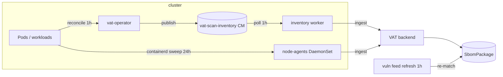
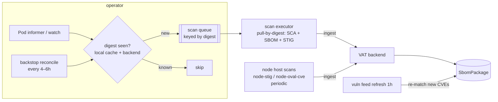

# Event-Driven Container Scanning

This document proposes moving VAT's container-image scanning from fixed-interval
polling to an **event-driven** model triggered on first-seen image digests, with
digest-level deduplication and a low-frequency backstop reconcile. The goal is
near-real-time coverage at **lower** cluster/VAT load than the current poll.

## Status

Proposed. No code changed yet. Supersedes the polling cadence described in
`vat-near-realtime-baseline.md` for container image scans only; node/host scans
are out of scope (see Non-goals).

## Problem

A newly scheduled container is scanned only on the next poll cycle:

- **Inventory worker** (`vat-scan scan-inventory`) reads the operator-published
  `vat-scan-inventory` ConfigMap every `VAT_SCAN_INTERVAL_SECONDS=3600` (1h).
- The **operator** rebuilds + publishes that inventory every
  `RescanIntervalSeconds=3600` (1h, `operator/internal/config/config.go`).
- **Node agents** (`vat-scan scan-runtime`) sweep each node's containerd images
  every `VAT_NODE_SCAN_INTERVAL_SECONDS=86400` (24h).

So a new workload image lands in VAT in **~1–2h**, and anything only visible at
runtime can take **up to 24h**. Worse, the periodic sweeps re-scan **unchanged**
images: ~190 images/node × 3 nodes daily ≈ **~570 image scans/day** plus the
worker's full rescan — almost all redundant.

## Key insight: vuln freshness is already decoupled from scanning

VAT stores each image's SBOM (`app/models/sbom.py` → `SbomPackage`) and the
hourly **vuln-feed refresh** re-matches stored SBOM packages against OSV/CVE data
(`app/services/vuln_feeds.py` → `_sbom_osv_target`, `_purl_to_osv_target`).
**New CVEs against existing images are found without re-pulling the image.**

Therefore an image only needs to be *scanned* (SBOM/STIG extracted) when its
**content changes** — i.e. when a new digest appears. The blind 24h full
re-scans buy almost nothing the hourly SBOM re-match doesn't already provide.

## Goals

- New container image scanned within **seconds** of the pod being observed.
- **Lower** steady-state scan/pull load — scan each digest once, not on a timer.
- No regression in vuln freshness (keep SBOM↔feed re-matching).
- No regression in coverage (every image `kubectl get pods -A` shows is covered).
- Survive operator restarts and missed events (a backstop guarantees eventual
  coverage).

## Non-goals

- **Node/host scans** (`node-stig`, `node-oval-cve` via `scan-node`): these scan
  the node OS, not images, change rarely, and have no per-image trigger. They
  stay on their periodic schedule.
- Changing the ingest/auth model, correlation, or SBOM/vuln-feed matching.
- Replacing trivy/openscap engines.

## Decisions

Resolved from review:

- **Dispatch — worker as queue consumer.** Repurpose the existing
  `vat-scanner-worker` Deployment to consume the scan queue with internal
  concurrency (`MaxConcurrentScanJobs`), rather than spawning a `Job` per digest.
  One warm pod absorbs bursts without per-scan pod-startup overhead and reuses a
  component we already run. (Per-digest Jobs remain a possible future option for
  stronger per-scan isolation.)
- **Queue substrate — a `ScanRequest` CRD.** Durable and observable
  (`kubectl get scanrequests`), survives operator restarts, and gives the worker
  a watchable, declarative work list. The operator owns creation + dedup; the
  worker claims an item, scans, and marks it done/failed.
- **Node-agent role — shrink to host scans only.** The event-driven
  registry-pull executor becomes the **single** image-scan path. Node agents keep
  running `node-stig`/`node-oval-cve` (host scans need their `hostPID`/host-root
  access and have no central equivalent) but stop scanning container images by
  default. Benefits: (a) it removes the overlapping second vantage that produced
  the cross-vantage digest "conflicts" we just fixed — with one image vantage,
  that whole class of false positives cannot recur; (b) fewer moving parts. An
  opt-in `VAT_NODE_AGENT_IMAGE_SCANS=true` re-enables node-local containerd image
  scanning for **air-gapped** clusters where pull-by-digest isn't viable
  (registry unreachable but the image is cached on-node).

## Current architecture (polling)

## Proposed architecture (event-driven)

### 1. Trigger — Pod informer in the operator

Replace the operator's `RescanIntervalSeconds` reconcile *ticker* (in
`cmd/vat-operator/main.go`) with a **client-go SharedInformer on Pods**
(all namespaces). On pod Add/Update, extract the work set:

- Images from `pod.spec.containers[]` + `pod.spec.initContainers[]` +
  `pod.spec.ephemeralContainers[]` (covers init/ephemeral — the gap the runtime
  "running only" path misses).
- The resolved digest from `pod.status.{init,}containerStatuses[].imageID`
  (`repo@sha256:…`). If status has no digest yet (image not pulled), fall back to
  the tag ref and resolve the digest at scan time.

The informer's periodic **resync** (e.g. 10–30 min) is a built-in safety net: it
re-delivers all known pods so a dropped watch event can't permanently miss an
image. This is cheap — it's metadata, not a scan.

### 2. Dedup by digest

The unit of work is the **image digest**, not the pod or tag. This is the load
lever:

- A 50-pod rollout sharing one digest ⇒ **1 scan**.
- A mutable tag moving to a new digest ⇒ a new scan (digest changed) — reuses the
  same digest key, so it's automatic.
- An already-scanned digest ⇒ skipped.

Dedup state has two layers so it survives operator restarts:

- **In-memory LRU/set** of recently-handled digests (fast path).
- **Backend source of truth**: a new endpoint
  `GET /api/scan/known-digests?since=…` (or a cheap `HEAD /api/scan/digest/{d}`)
  returning the set of digests VAT already has findings/SBOMs for. The operator
  warms its cache from this on startup, then maintains it from events. VAT
  already persists digests (`findings.image_digest`,
  `asset_observed_tags.last_digest`), so this is a read-only projection.

### 3. Scan executor — pull by digest

A new digest is enqueued and scanned **once**, by content address:

- Pull `repo@sha256:<digest>` via the egress proxy using the existing pull
  secrets (`harbor-creds`, `ghcr-creds`).
- Run the image scan types: `image-sca` (trivy → SBOM + vulns), `image-sbom`
  (cyclonedx), `container-stig` (openscap against the image filesystem).
- Ingest with the real image tag(s) observed for that digest (the
  `container-stig`-as-tag bug is already fixed; tag comes from the image ref).

Dispatch is the **worker-as-consumer** model (see Decisions): the
`vat-scanner-worker` Deployment stops polling the full inventory hourly and
instead **watches `ScanRequest` CRs**, claiming pending digests and scanning them
with internal concurrency (`MaxConcurrentScanJobs`). One warm pod, no per-scan
startup, good burst behavior. The operator creates a `ScanRequest` per new digest
(deduped); the worker transitions it `pending → scanning → done|failed`; failed
items are retried with backoff and, if exhausted, left for the backstop.

Scanning by **digest from the registry** means the executor needs no node-local
containerd access, so it doesn't have to run on the image's node — and it makes
the worker the **single image-scan vantage** (node agents no longer scan images
by default; see Decisions), so the cross-vantage digest-representation conflicts
we fixed earlier cannot reappear.

### 4. Drop the blind full image re-scans; keep SBOM re-match

- Remove the 24h `VAT_*_FULL_RESCAN_INTERVAL_SECONDS` blanket image re-scans.
- Vuln freshness for **unchanged** images continues via the hourly vuln-feed
  refresh re-matching stored SBOMs — unchanged.
- Optional, low-frequency **scanner-version re-scan** (e.g. weekly, or gated on a
  trivy DB/engine version bump) to pick up detections that depend on the scanner
  itself, not the feed. This is rare and bounded.

### 5. Backstop reconcile

Keep a **periodic full reconcile every 4–6h** (the current logic, slowed down):
list all pods/workloads, compute the digest set, diff against
`known-digests`, enqueue anything missing. This guarantees eventual coverage if
the informer missed events (operator downtime, watch resync gaps, pull failures
that exhausted retries). It is the correctness floor; the informer is the latency
optimization.

## Edge cases

- **Image not yet pulled** (no `imageID` digest in status): enqueue by tag ref;
  the executor resolves + records the digest at scan time. Dedup then keys on the
  resolved digest.
- **Private images** (ghcr/harbor): executor uses the pull secrets; on
  auth/pull failure, retry with backoff, then leave for the backstop and emit a
  metric/log (don't silently drop).
- **Burst / stampede** (rollouts, `kamiwaza-sandboxes` churn): digest-dedup
  collapses identical images; the queue + `MaxConcurrentScanJobs` bounds
  concurrency so the single-replica backend isn't flooded (the same
  connection-refused failure mode we hit when restarting all node-agents at
  once). Debounce rapid re-adds of the same digest.
- **Short-lived pods** (init containers, Jobs that complete in seconds): the
  informer Add event carries the pod *spec* images even if the container already
  exited, so they're still enqueued.
- **Operator HA**: if more than one operator replica, use leader election
  (client-go `leaderelection`) so only the leader runs the informer/queue.
- **Multi-arch digests**: scan the digest as observed in pod status (the platform
  actually running); the digest-conflict logic is already vantage-aware.

## Load & latency analysis

| | Polling (today) | Event-driven |
|---|---|---|
| New-image latency | ~1–2h (worker), up to 24h (node) | seconds (informer) |
| Image scans/day (steady) | ~570+ (24h full sweeps re-scan unchanged) | ~#new-digests/day (handful) |
| Vuln freshness | hourly feed re-match | unchanged (hourly feed re-match) |
| Backend pull/scan load | continuous polling + full rescans | one scan per new digest + backstop |

The per-image scan cost is identical (each digest scanned once); the saving is
eliminating the repeated re-scans of unchanged content. Expect a **~90%+
reduction** in image pulls/scans in a steady cluster, *and* lower latency — the
point you raised.

## Migration / rollout

Phased, non-breaking:

1. **Shadow.** Add the Pod informer + `known-digests` endpoint + queue, but have
   the executor run in **dry-run/log-only** mode. Compare the digests it *would*
   scan against what the existing poll covers. Validate no coverage gap (reuse
   the `kubectl get pods -A` ↔ canonical-asset check from this session).
2. **Enable executor, keep poll slow.** Turn on event-driven scanning; raise the
   worker poll to the backstop interval (4–6h) rather than removing it.
3. **Drop full rescans.** Remove the 24h blanket image re-scans once event-driven
   coverage + SBOM re-match are confirmed equivalent. Keep the backstop.
4. **Tune.** Set informer resync (10–30m) and backstop (4–6h) from observed
   missed-event rates.

A feature flag (`VAT_OPERATOR_EVENT_DRIVEN_SCANS`) gates the informer so it can
be rolled back to pure polling instantly.

## Risks & mitigations

- **Missed events → coverage gap.** Mitigated by informer resync + the backstop
  reconcile (the correctness floor). Coverage is *eventually* complete regardless
  of event reliability.
- **Burst overload of the single-replica backend.** Mitigated by digest-dedup +
  bounded queue concurrency + debounce. (Also a good reason to consider backend
  HA, tracked separately.)
- **RBAC.** The operator needs cluster-wide Pod *watch/list* (it already lists
  workloads). The executor needs the pull secrets (already wired).
- **Complexity.** Informers + queue + dedup are more moving parts than a poll.
  The phased rollout + feature flag + retained backstop keep it reversible and
  the poll path alive as a fallback.

## Metrics / observability

- `scan_latency_seconds` — pod first-observed → ingest complete (target p95 < 60s).
- `image_scans_total{trigger="event|backstop"}` — event vs backstop ratio
  (backstop should be a small tail; a large tail means events are being missed).
- `scan_dedup_hits_total` — digests skipped as already-known.
- `scan_queue_depth`, `scan_failures_total{reason}` — burst/pull health.
- Alert if `backstop`-triggered scans exceed a threshold (informer unhealthy) or
  if any digest stays unscanned past N backstop cycles.

## Alternatives considered

- **Node-agent containerd image-event watch.** Each node agent watches containerd
  for image pulls and scans locally (no re-pull). More distributed and catches
  runtime-only images, but duplicates SCA/SBOM/STIG logic per node, needs the
  containerd events API, and complicates dedup across nodes. Registry-pull-by-
  digest from one operator-driven executor is simpler and centralizes dedup. Node
  agents are kept as an optional backstop/offline path.
- **Admission webhook.** Scan-gate at pod admission. Adds an availability-
  critical path to scheduling (a scanner outage blocks deploys) for no coverage
  benefit over async event scanning. Rejected.
- **Just shorten the poll intervals.** Lowers latency but *raises* load (more
  frequent full sweeps) — the opposite of the goal.

## Open questions

Dispatch, queue substrate, and node-agent role are settled (see Decisions). What
remains is empirical, to set in the rollout's tuning phase:

1. **Backstop cadence and informer resync** values — start at 4–6h / 10–30m and
   tune from the observed `image_scans_total{trigger="backstop"}` tail (a large
   tail means events are being missed and the informer needs attention).
2. **Retry/backoff budget** for pull failures before an item is parked for the
   backstop (e.g. 5 attempts with exponential backoff, mirroring the ingest and
   `ensure_source` retry behavior).
3. **`ScanRequest` retention/TTL** — how long to keep `done`/`failed` CRs for
   observability before garbage-collecting them.
